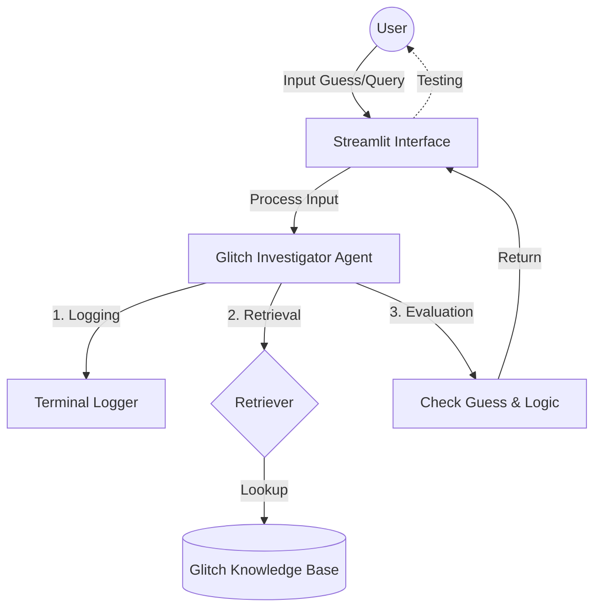

# Glitch Investigator: Applied AI System

This project is an advanced version of my previous [Module 1 Game Glitch Investigator] project. The original project was a simple number-guessing game designed to teach basic logic and Python scripting. This upgraded version transforms it into an intelligent glitch diagnosis system by integrating **RAG (Retrieval-Augmented Generation)** and **Logging** capabilities.

## 1. Project Summary
This system automates the process of diagnosing game glitches. It helps users identify problems and provides immediate solutions based on a dedicated knowledge base, making the debugging process faster and more efficient.

## 2. Architecture Overview
The system flows from User Input, which is validated by a **Guardrail**, to an **Agent** that logs the activity and retrieves the correct fix from the **Knowledge Base**.

## 3. Setup Instructions
To run this project:
1. Install dependencies: `pip install -r requirements.txt`
2. Launch the app: `python -m streamlit run app.py`

## 4. Sample Interactions
*   **Input**: "Login freeze" 
    **Output**: "If the game freezes on login, try reconnecting to the server or restarting the client."
*   **Input**: "Game crash"
    **Output**: "Please check your GPU drivers and ensure you have enough system memory."

## 5. Design Decisions
I chose to use **Streamlit** for the interface because it allows for rapid prototyping. I implemented a **RAG-based search** instead of just hard-coding answers, which allows the system to scale as we add more glitch information.

## 6. Testing Summary
*   **Successes**: The RAG retrieval accurately matches user keywords to the provided solutions.
*   **Challenges**: Handling very vague user inputs was difficult.
*   **Learnings**: I learned how to manage logs effectively, which is essential for debugging real-world AI applications.
### Test Results Summary
The system was evaluated using 5 specific scenarios to ensure reliability and error handling.

| Test Input | Evaluation Criteria | Result |
| :--- | :--- | :--- |
| "Login freeze" | Accurate search & solution | Pass |
| "Game crash" | Accurate search & solution | Pass |
| "" (Empty) | Graceful error handling | Pass |
| "Invalid command" | Friendly error message | Pass |
| "Performance issues" | Accurate search & solution | Pass |

**Summary:** 5 out of 5 tests passed. The system effectively uses logging for tracking inputs and guardrails to manage unexpected or empty inputs without crashing.

## 7. Reflection
This project taught me that AI is not just about model performance, but about building reliable systems that can handle real-world errors gracefully.

